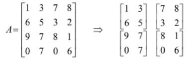

# Practice-Problems
These are some simple practice problem related to java.
The Questions solved are given below: <h4 align ="center">Assignment 1</h4> 
<ol><li>Write a JAVA program to find the multiplication of given 4 numbers. Also find their geometric mean.</li>
<li>Write a JAVA program which reads the value of the height and radius of the base of a cylinder and
calculates the Volume of that cylinder.</li> 
<li>
Given as input a floating (real) number of centimeters, print out the equivalent number of feet (integer)
and inches (floating, 1 decimal), with the inches given to an accuracy of one decimal place.</li> 
<li>
Given as input an integer number of seconds, print as output the equivalent time in hours, minutes and
seconds. Recommended output format is something like 7322 seconds is equivalent to 2 hours 2 minutes
2 seconds.
</li> 
<li>
Write a JAVA program to multiply two numbers without using * operator.
</li> 
<li>
Write a JAVA program to find the roots of the quadratic equation and display a message that roots are
equal or distinct or real or complex.
</li> 
<li>
Write a JAVA program to find whether given integer n is a power of 2 or not. Also write a
separate/same program to generate a first 50 power of 2 numbers.
</li> 
<li>
Write a JAVA program to reverse a given number of 5 digits.
</li> 
<li>
Write a JAVA program find the median of n numbers given by user.
</li> 
<li>
Write a JAVA program to find the maximum of three numbers using ternary operator.
</li> 
<li>
Evaluate the following expressions: 
(i) x = 2 % 2 + 2 * 2 - 2 / 2; 
(ii) Given a=4, b=5 and c=6; 
Find ((a < b) || (b > c) && (a > b) || (!(a > c))) 
(iii) i=8, j=5, x=0.005, y=-0.01 
Find 5* ((i / 7) + ( j *(i - 3))%(x + y - 2 + i)) 
(iv) Given x=10 ,Find y=--x * x-- 
(v) y=(t=6, 7*t+2) 
</li> 
<li>
Write a JAVA program which reads two numbers x and y, then find the GCD of x and y.
</li> 
<li>
Write a JAVA program to find the sum of integers between 50 and 100, which are divisible by 7.
</li> 
<li>
Write a JAVA program to find the factorial of number using (i) for loop (ii) while loop (iii) do loop
</li> 
</ol> 

<h4 align="center"> Assignment 2</h4> 
<ol>
<li>
Write a JAVA program which asks the user to supply an alphabet in upper case from the key
board. Then convert the alphabet in lower case.
</li> 
<li>
Write a JAVA program to display the names of the Months of the year, depending upon the
number entered by the user using: 
(i) if – else  (ii) switch – case
</li> 
<li>
Read a positive integer value, and compute the following sequence: If the number is even,
halve it; if it's odd, multiply by 3 and add 1. Repeat this process until the value is 1, printing out
each value. Finally print out how many of these operations you performed. Write a JAVA
Program.
</li> 
<li>
Write a JAVA program to find the sum of the following series using
(a) for loop (b) while loop and (c) do-while loop 
I. Sum = 1+ 5 +10 +15 + ....+ n 
II. Sum = 1- 1/1!+ 2/2! - 3/3! + 4/4!-.... 
III. Sum = x - x3/3! + x5/5!-......-xn/n! 
IV. Sum = 12+22+32+42+52+.....+n2 
V. Sum = 13-33+53-....n3 
</li> 
<li>
Write a JAVA program to simulate a calculator where the user enters two integer numbers and
an operator (+, -, *, /, %). The program then carries out the specified operation and displays the
result. Write using if statement as well as switch statement.
</li> 
<li>
Write a JAVA program to display the table of a given number.
</li> 
<li>
Write a JAVA program to check for palindromes for Integers as well as string using( For
example 1221, 57866875 and avon sees nova are some palindromes):
(i) if – else (ii) switch – case
</li> 
<li>
Write a JAVA program to find the maximum and minimum of n numbers using:

(a) for loop (b) while loop and (c) do-while loop
</li> 
<li>
Write a JAVA program to check if given two numbers are relatively prime or not.
</li> 
<li>
Write a JAVA program to find the perfect numbers between 1 to 100000. m is a perfect number
if &sigma;(m) = 2m , that is if m is the sum of all its positive divisors other than itself. &sigma; (m) - sum of the positive divisors of m. For example &sigma; (12) = 1+ 2 + 3 + 4 + 6 +12 = 28 where 1,
2, 3, 4, 6 and 12 are the positive divisors of 12.
For example 28 is a perfect number &sigma; (28) = 1 + 2 + 4 + 7 + 14 + 28 = 56
</li> 
<li>
Write a JAVA program to generate Hemachandra series, 1, 2, 3, 5, 8, 13, 21...
</li> 
</ol> 

<h4 align = "center"> Assignment 3</h4> 
<ol>
<li>
Ten numbers are entered from the keyboard into an array. The number to be searched is
entered through the keyboard by the user. Write a program to find if the number to be
searched is present in the array and if it is present, display the number of times it appears
in the array.
</li> 
<li>
Ten numbers are entered from the keyboard into an array. Write a program to find out
how many of them are positive, how many are negative, how many are even and how
many are odd.
</li> 
<li>
Write a program to copy the contents of one array into another in the reverse order. The
program should take double type values from the keyboard.
</li> 
<li>
WAP for 5 × 5 matrix (a) entered through the keyboard (b) initialized in the program and
stored in a 2-dimensional array mat[5][5]. Write a program to obtain the Determinant
values of this matrix
</li> 
<li>
Given two matrices A and B find its product using JAVA where A and B are Cartan
matrices.
A Cartan matrix is a square integer matrix who elements ( Ai,j) satisfy the following
conditions.
<ul>
<li> Ai,j is an integer, one of belongs to {-3, -2, -1, 0, 2}.</li>
<li> Ai,j = 2 the diagonal entries are all 2.</li>
<li> Ai,j≤0 off of the diagonal.</li>
<li>Ai,j =0 iff Ai,j =0.</li>
</ul>
More about Cartan matrix can be found in
http://mathworld.wolfram.com/CartanMatrix.html
</li> 
<li>
WAP to check whether given matrix is Upper Triangular or not.
</li> 
<li>
WAP to find the maximum element of a given matrix.
</li> 
<li>
WAP to find the non overlapping sub-matrix of the given matrix of given order. If the
given matrix is A and order of sub-matrix is 2 then 

</li> 
<li>
Write and test the function that rotate 90 and 180 degrees clockwise a two dimensional
square array of integers.
</li> 
</ol>